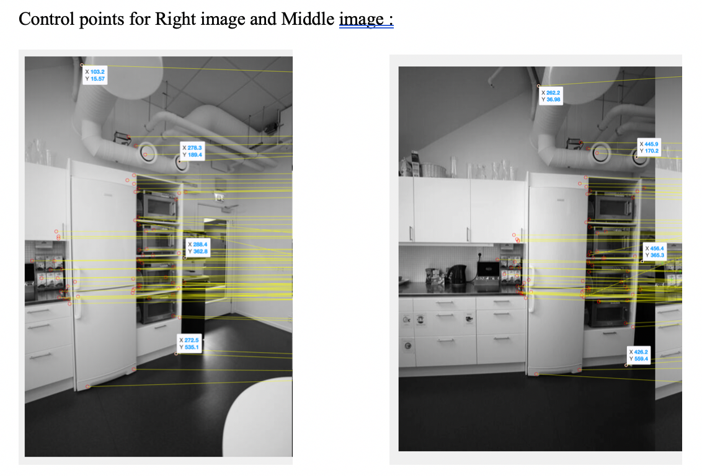
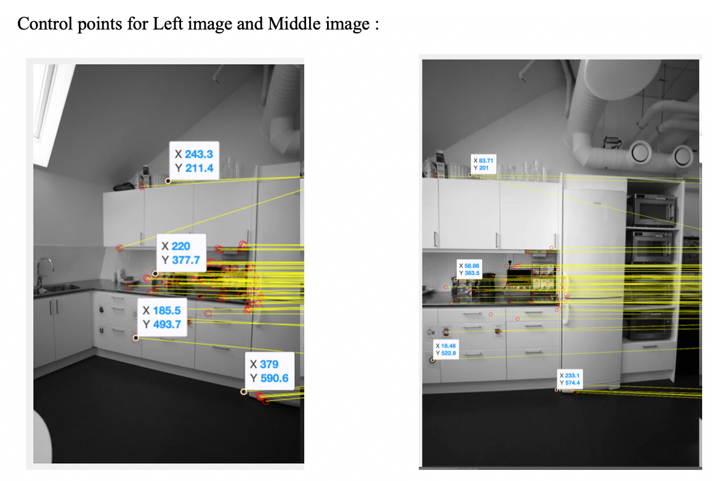
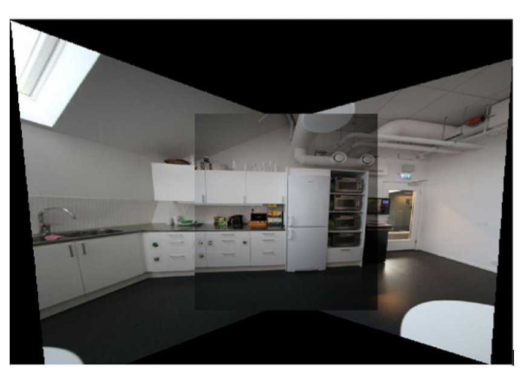

##  Homographic Transformation and Image Stitching:

Image stitching is mainly used to combine multiple images with different angle perspective. Here the images with matching points are overlapped to produce a high-resolution image of a segmented panorama. Here in this assignment we are given three images of a lunchroom which are taken with three different angles. All these images are stitched together finding the strong key points. 
### Approach and Procedure:
The below are the basic procedure used for image stitching purpose:
The very first step is to find the control points from the sequence of images. Here I have used SURF feature detection and FLANN feature matching to identify the matching control points. Among the obtained matching control points, only four control points are selected such that they cover a very good area across the given image. These control points are used to obtain the homographic matrix to find the points to map the images. Inverse warping is used to blend the sequence of images to one another. The new image stitched is made big enough by providing offset and the final Panorama image is written.
### Sample Results:

### Discussion:
The above shown image shows almost perfect image stitching of the three images provided. Here the selection of key control points plays important role in image stitching processing. While computing H matrix, we need to solve 8 equations for nine unknow variables. Here we are considering H33 to be 1 for simplification of the calculations.
The functions detectSURFFeatures() and extractfeatures() provide us the points on the images which we have to look into for matching points on sequence of the images.I have used OpenCV MATLAB for this purpose. After obtaining the matching features using showMatchedFeatures(), we select four control points. The control points are to be selected such that it covers pretty good area of the images to be stitched. Here we are selecting four control points as we have 8 equations. With the increased in the number of control points, we obtain better overlapping of the images stitched.  Also, we use bilinear interpolation to reduce the distortion created while overlapping the images on one another. 

